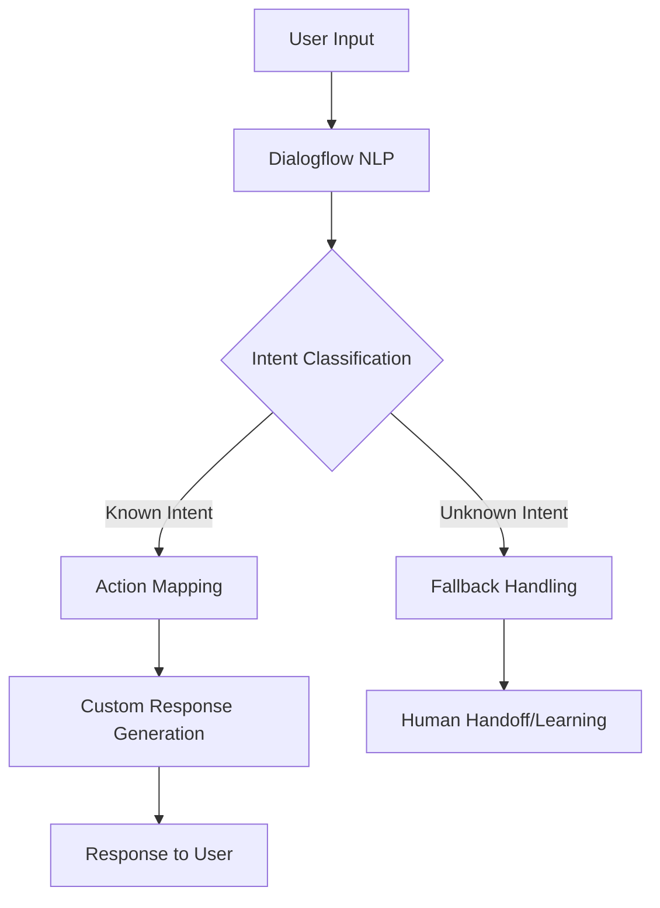

# ChatBot: Advanced AI-Powered Conversational Platform

## 🚀 Project Overview
ChatBot is a cutting-edge, full-stack web application designed to provide an intelligent, secure, and user-friendly conversational experience. Built with modern web technologies, it offers robust authentication, real-time interactions, and scalable architecture.

## 🌟 Key Features
- **Secure Authentication**
  - User registration and login
  - JWT-based authentication
  - Secure password hashing
  - Session management

- **Responsive UI**
  - Modern, clean design
  - Material-UI components
  - Responsive layout
  - Dark/Light theme support

- **State Management**
  - React Context API
  - Consistent authentication state
  - Centralized error handling

## 🛠 Tech Stack
- **Frontend**
  - Next.js 14
  - React 18
  - Material-UI
  - React Hooks
  - TypeScript (optional)

- **Backend**
  - Next.js API Routes
  - Prisma ORM
  - PostgreSQL/SQLite
  - Zod Validation
  - JWT Authentication

- **Authentication**
  - Bcrypt for password hashing
  - HTTP-only cookies
  - Secure token generation

## 📦 Project Structure
```
chatbot/
│
├── src/
│   ├── app/
│   │   ├── api/
│   │   │   └── auth/
│   │   ├── login/
│   │   ├── signup/
│   │   └── chat/
│   │
│   ├── context/
│   │   └── AuthContext.jsx
│   │
│   ├── components/
│   │   └── ...
│   │
│   └── theme/
│       └── ThemeProvider.jsx
│
├── prisma/
│   └── schema.prisma
│
└── lib/
    ├── jwt.js
    └── prisma.js
```

## 🔧 Setup and Installation
1. Clone the repository
   ```bash
   git clone https://github.com/yourusername/chatbot.git
   cd chatbot
   ```

2. Install dependencies
   ```bash
   npm install
   ```

3. Set up environment variables
   ```bash
   cp .env.example .env
   # Edit .env with your configuration
   ```

4. Initialize database
   ```bash
   npx prisma migrate dev
   ```

5. Run the development server
   ```bash
   npm run dev
   ```

## 🌈 Potential Future Enhancements

### 1. AI Integration
- OpenAI/Anthropic API integration
- Context-aware conversation handling
- Multi-language support
- Sentiment analysis
- Intent recognition

### 2. Advanced Authentication
- OAuth (Google, GitHub)
- Two-factor authentication
- Social login
- Passwordless authentication
- Advanced user roles and permissions

### 3. Chat Features
- Real-time messaging
- Message threading
- File/image sharing
- Voice/video chat
- Conversation history
- Search functionality

### 4. User Experience
- Personalized chat themes
- Custom avatar selection
- Accessibility improvements
- Internationalization
- Offline support

### 5. Performance & Scalability
- WebSocket for real-time updates
- Redis caching
- Microservices architecture
- Horizontal scaling
- Performance monitoring

### 6. Machine Learning
- Chatbot training interface
- Custom model fine-tuning
- Conversation recommendation
- User behavior analytics
- Predictive text/response generation

### 7. Security Enhancements
- Advanced threat detection
- Rate limiting
- IP reputation tracking
- Comprehensive logging
- Security audits

### 8. Integrations
- Slack/Discord bot
- CRM integration
- Support ticket system
- API marketplace
- Webhook support

## 🤖 Dialogflow NLP Integration: Advanced Conversational Intelligence

### Overview of Dialogflow Integration
Dialogflow, powered by Google Cloud AI, offers a sophisticated Natural Language Processing (NLP) solution that can transform our chatbot from a simple messaging platform to an intelligent conversational agent.

### Key NLP Capabilities
1. **Intent Recognition**
   - Accurately identify user intentions
   - Map complex user queries to specific actions
   - Handle variations in user language and phrasing

2. **Entity Extraction**
   - Automatically detect and classify key information
   - Extract dates, numbers, names, locations
   - Understand context and nuanced user requests


### Technical Integration Architecture


### Implementation Strategies
1. **Webhook Fulfillment**
   ```javascript
   async function dialogflowWebhook(request) {
     const intent = request.body.queryResult.intent.displayName;
     const parameters = request.body.queryResult.parameters;

     switch(intent) {
       case 'UserAuthentication':
         return authenticateUser(parameters);
       case 'BookingIntent':
         return processBooking(parameters);
       default:
         return generateGenericResponse();
     }
   }
   ```

2. **Context Management**
   - Maintain conversation context across multiple interactions
   - Track user state and previous conversation history
   - Enable more natural, context-aware responses

### Advanced NLP Features
- **Sentiment Analysis**
  - Detect user emotional state
  - Adjust responses based on sentiment
  - Provide empathetic interactions

- **Machine Learning Improvements**
  - Continuous model training
  - Learn from user interactions
  - Improve accuracy over time

### Integration Benefits
- 🚀 **Enhanced User Experience**
  - More intelligent conversations
  - Reduced manual intervention
  - Personalized interactions

- 🔍 **Improved Understanding**
  - Handle complex queries
  - Reduce misunderstandings
  - Provide relevant responses

- 📊 **Scalable Intelligence**
  - Easy to expand conversational capabilities
  - Minimal backend complexity
  - Cloud-managed AI infrastructure

### Potential Use Cases
1. Customer Support
2. Booking Systems
3. Information Retrieval
4. Guided Workflows
5. Interactive Tutorials

### Security and Compliance
- **Data Privacy**
  - Secure API communication
  - GDPR and CCPA compliant
  - End-to-end encryption

- **Access Control**
  - Role-based access
  - Audit logging
  - Controlled information exposure

### Cost and Scaling
- **Pricing Tiers**
  - Free tier for development
  - Pay-as-you-go model
  - Predictable scaling costs

- **Performance**
  - Low-latency responses
  - Horizontal scalability
  - Global edge network

### Sample Integration Code
```typescript
// Dialogflow Service
class DialogflowService {
  private sessionClient: SessionsClient;

  constructor() {
    this.sessionClient = new dialogflow.v2.SessionsClient();
  }

  async detectIntent(text: string, sessionId: string) {
    const request = {
      session: this.sessionClient.projectAgentSessionPath(
        PROJECT_ID, 
        sessionId
      ),
      queryInput: {
        text: {
          text,
          languageCode: 'en-US'
        }
      }
    };

    try {
      const [response] = await this.sessionClient.detectIntent(request);
      return response.queryResult;
    } catch (error) {
      console.error('NLP Processing Error', error);
      return null;
    }
  }
}
```

### Recommended Next Steps
1. Create Dialogflow agent
2. Define intents and entities
3. Implement webhook fulfillment
4. Integrate with existing authentication
5. Continuous model training

### Learning Resources
- [Dialogflow Documentation](https://cloud.google.com/dialogflow/docs)
- [Google Cloud NLP Guide](https://cloud.google.com/natural-language/docs)
- [Machine Learning Conversational Patterns](https://research.google/pubs/conversational-ai/)

### Disclaimer
Dialogflow integration requires:
- Google Cloud Account
- API Credentials
- Ongoing maintenance
- Potential additional costs

## 🤝 Contributing
1. Fork the repository
2. Create your feature branch
3. Commit your changes
4. Push to the branch
5. Create a Pull Request

## 📄 License
This project is licensed under the MIT License.

## 🌟 Star the Repository
If you find this project helpful, please give it a star! ⭐

## 📞 Support
For issues, questions, or suggestions, please [open an issue](https://github.com/yourusername/chatbot/issues).
